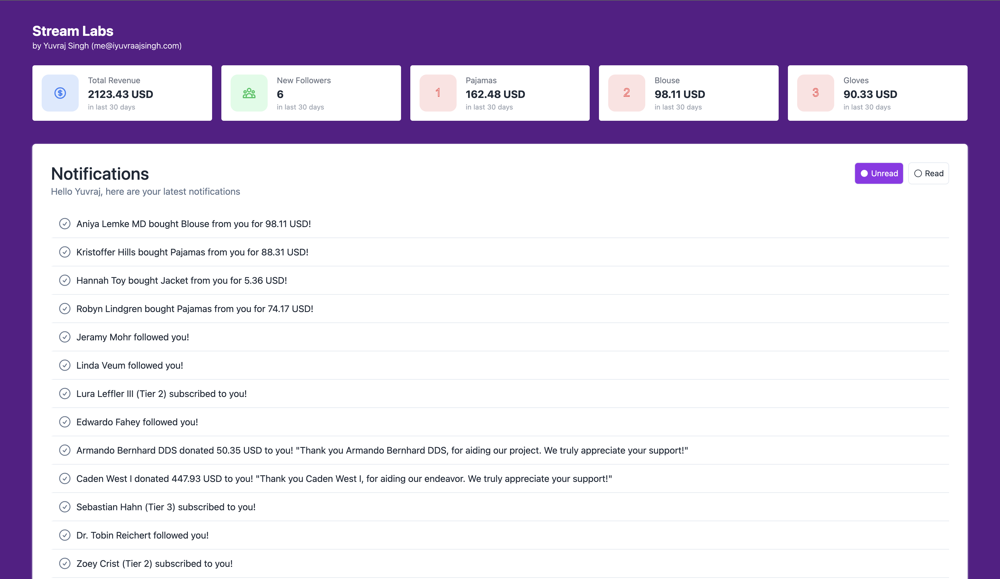
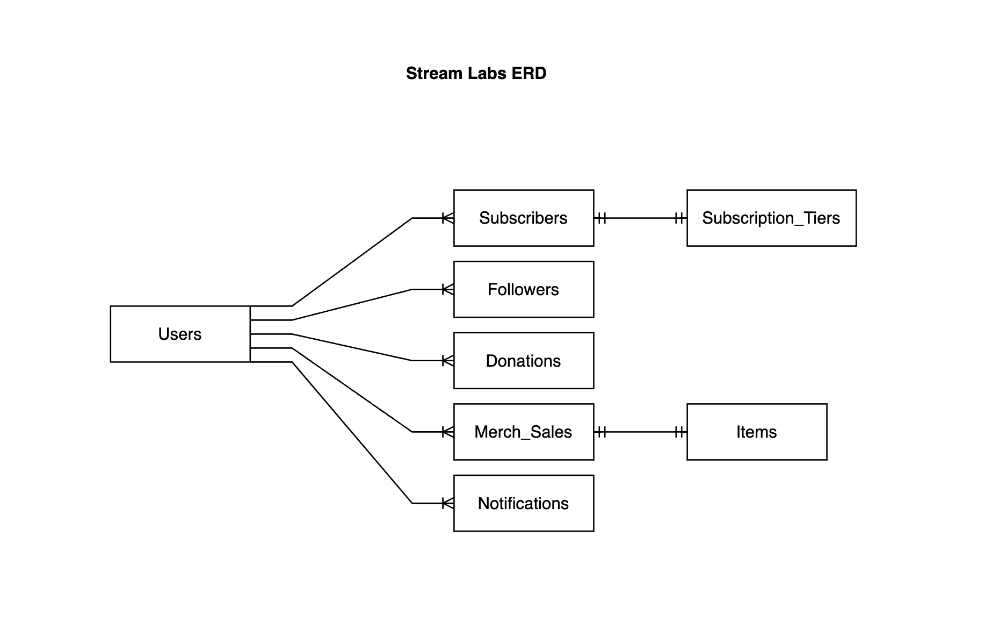

# Streamlabs Application

## Home Screen



## ERD (Entity Relationship Diagram)



---

## Table of Contents

- [Installation Instructions](#installation-instructions)
  - [Frontend](#frontend)
  - [Backend](#backend)
- [Running the Applications](#running-the-applications)
- [Database Migrations and Seeders](#database-migrations-and-seeders)

---

## Installation Instructions

### Frontend

1. Navigate to the `streamlabs-frontend` directory:
   ```bash
   cd streamlabs-frontend
   ```
2. Install the dependencies:
   ```bash
   npm install
   ```

### Backend

1. Navigate to the `streamlabs-backend` directory:
   ```bash
   cd streamlabs-backend
   ```
2. Install the dependencies using Composer:

   ```bash
   composer install
   ```

3. Copy the `.env.example` file and create a new `.env` file:

   ```bash
   cp .env.example .env
   ```

4. Generate an application key:

   ```bash
   php artisan key:generate
   ```

5. Generate a JWT secret for authentication:
   ```bash
   php artisan jwt:secret
   ```

## Running the Applications

### Frontend

From the `streamlabs-frontend` directory:

```bash
npm start
```

### Backend

From the `streamlabs-backend` directory:

```bash
php artisan serve
```

## Database Migrations and Seeders

After setting up your `.env` file with the appropriate database configurations, execute the following commands in the `streamlabs-backend` directory:

1. Migrate the database:
   ```bash
   php artisan migrate
   ```
2. Seed the database:
   ```bash
   php artisan db:seed --class=UsersSeeder
   php artisan db:seed --class=FollowersSeeder
   php artisan db:seed --class=SubscriptionTierSeeder
   php artisan db:seed --class=SubscribersSeeder
   php artisan db:seed --class=DonationsSeeder
   php artisan db:seed --class=ItemsSeeder
   php artisan db:seed --class=MerchSalesSeeder
   ```

## Thanks

Please reach out `me@iyuvraajsingh.com` if you have any issues to run the project.
